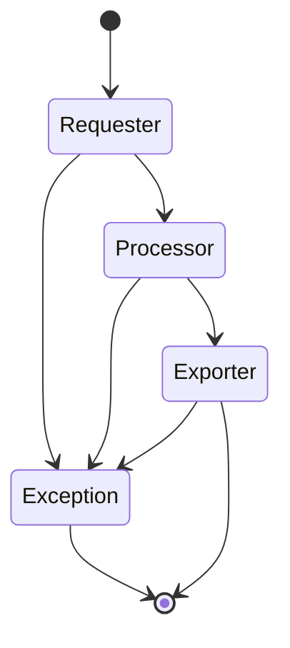

# anchor

#### 0. Goal

Anchor some data in the web and automatically save periodically.

Currently running tasks:

- [Tencent Careers](https://careers.tencent.com/jobopportunity.html)
- 

#### 1. Why do this

Things are always changing, and I want to find a way to record this change easily.

A web crawler is a great tool to get data from web efficiently. So does [GitHub Action](https://docs.github.com/en/actions), which automate the process.

Solve real problems by combing existing tools is what *anchor* will do.

#### 2. Design concept

##### 2.1 Tools

- GitHub Action
- Python3
  - 

##### 2.2 Architecture

Inspired by [Scrapy](https://scrapy.org/).

The process is very simple.

- **DataItem**: user-defined data model
- **Requester**: issue a network request
- **Responser**: store information of response
- **Processor**: pure function to convert data from requester to *DataItem*
- **Exporter**: deal with *DataItem*, like saving to `.json` file or exporting to DB, etc.
- **Task**: a task scheduled by *Anchor Engine*
- **Anchor Engine**: asynchronous style task handler

#### Reference:

1. https://scrapy.org/
